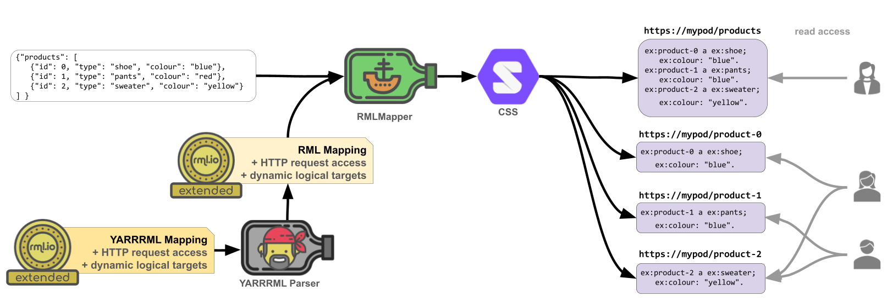
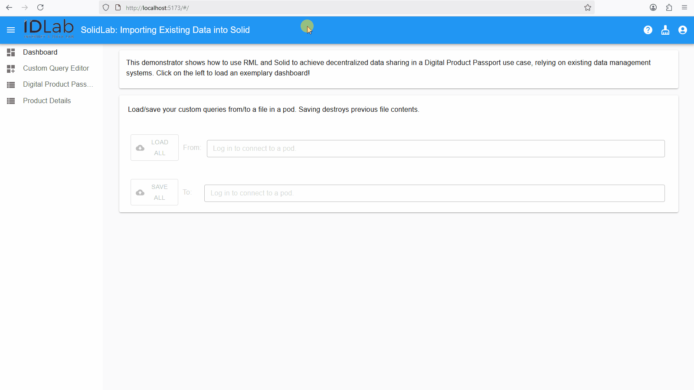

# Demonstrator for SolidLab End Event 19/01/2026

## Introduction

This demonstrator illustrates the capabilities of the end-to-end pipeline presented in the paper 'Extending RML to Support Permissioned Data Sharing with Multiple Views' with the concept of a Digital Product Passport. 

The end-to-end pipeline takes heterogeneous data sources and an extended YARRRML mapping as input.   
Following YARRRML extensions are included in the extended YARRRML mapping: 
- [HTTP Request Access in YARRRML](https://w3id.org/imec/rml/yarrrml/spec/access/httprequest/20250312/)
- [Dynamic Targets in YARRRML](https://w3id.org/imec/rml/yarrrml/spec/target/dynamictarget/20250226/)

The extended YARRRML mapping converted to an extended RML mapping using [YARRRML Parser v.1.10.0](https://github.com/RMLio/yarrrml-parser/releases/tag/v1.10.0) as YARRRML processor. 

Following RML extensions are included in the extended RML mapping:  
- [HTTP Request Access specification](https://w3id.org/imec/rml/specs/access/httprequest/20250312/)
- [Dynamic Target specification](
  https://w3id.org/imec/rml/specs/target/dynamictarget/20250113/)

The extended RML mapping is executed with [RMLMapper v7.3.1](https://github.com/RMLio/rmlmapper-java/releases/tag/v7.3.1) as RML processor.  

The extended RML mapping defines logical targets for resources on a Solid pod hosted by a [Community Solid Server v7.1.3](https://github.com/CommunitySolidServer/CommunitySolidServer/releases/tag/v7.1.3).  




## Conceptual Setup

The demonstrator simulates how three manufacturers share their data with users, each with distinct access rights to the manufacturers' data.   
Per manufacturer, we created in [./SourceData/](./SourceData) 
(i) source data about products and their properties, 
(ii) a CSV file to manage the access control,
(iii) a CSV file with basic company details  
(iii) an extended YARRRML mapping
and in [./CommunitySolidServer/pods/](./CommunitySolidServer/pods/) (iv) a Solid pod.

For the users, who get read access to selected parts of the manufacturers' data, we created additional Solid pods:
[./CommunitySolidServer/pods/userX/](./CommunitySolidServer/pods/)
.

The authentication details for the manufacturers and users adhere to following pattern (X should be replaced the manufacturer's or user's number): 

| email                   | password | webId                                                   | oidcIssuer                        |  
|-------------------------|----------|---------------------------------------------------------|-----------------------------------|
| hello@manufacturerX.com | abc123   | http://localhost:3000/manufacturerX/profile/card#me     | http://localhost:3000/            |  
| hello@userX.com         | abc123   | http://localhost:3000/userX/profile/card#me | http://localhost:3000/            |  

With the end-to-end pipeline, we convert the extended YARRRML mappings to extended RML mappings, and execute the extended RML mappings to convert the source data and access control data to RDF data and to publish the RDF data on the Solid pods of the manufacturers.

## Technical Setup

### Prerequisites

- a bash shell 
- Java version 17 (We tested with OpenJDK v17.0.2)
- [Docker Engine](https://docs.docker.com/engine/)
- Node (We tested with Node v20.00.0)

### Community Solid Server
To avoid any library conflicts, especially with Comunica, we start the Communtiy Solid server as a Docker. 
To start the Community Solid Server, run following command: 
```shell
cd ./CommunitySolidServer
docker run --name CSS --rm -v $(pwd)/config:/config -v $(pwd)/pods:/pods -p 3000:3000 solidproject/community-server -c /config/file.json --seedConfig /config/seeded-pod-config.json -f /pods 
```
**Note for Windows users**: Using `$(pwd)` won't just work to get the "present working dir". Here are a few alternatives:
- MinGW / git bash: use `/$(pwd)`
- Windows command line (cmd): `%cd%`
- PowerShell: `${PDW}`  
Example for PowerShell: 
````
docker run --name CSS --rm -v ${PWD}/config:/config -v ${PWD}/pods:/pods -p 3000:3000 solidproject/community-server -c /config/file.json --seedConfig /config/seeded-pod-config.json -f /pods  
````

The configuration of the Solid pods can be adapted in this file: 
[./CommunitySolidServer/config/seeded-pod-config.json](./CommunitySolidServer/config/seeded-pod-config.json). 

In this repository contains the state of the Solid pods after executing the YARRRML mappings. 
This allows us to refer to specific resources on the Solid pods to explain the features of the RML+Solid pipeline.   
To restart from scratch, stop the docker, delete the content of the folder [./CommunitySolidServer/pods](./CommunitySolidServer/pods), restart the CommunitySolidServer,and execute the RML mappings with RMLMapper.

In a new terminal:  
```shell
docker stop CSS
cd ./CommunitySolidServer
rm -r ./pods/
docker run --name CSS --rm -v $(pwd)/config:/config -v $(pwd)/pods:/pods -p 3000:3000 solidproject/community-server -c /config/file.json --seedConfig /config/seeded-pod-config.json -f /pods
```

### RMLMapper

- Download [RMLMapper v8.1.0](https://github.com/RMLio/rmlmapper-java/releases/download/v8.1.0/rmlmapper-8.1.0-r380-all.jar) as `rmlmapper.jar` in the folder [./SourceData](./SourceData). 
- In a new terminal execute the extended RML mapping of the three manufacturers (this may take some minutes).
````shell
cd ./SourceData
chmod 744 ./executeMappings.sh # needed only at first use
./executeMappings.sh
````

(For Windows users with Powershell replace `$(pwd)` by `${PWD}` in the bash script)

The content of the Solid pods after the executing of the RML+Solid pipeline can be inspected easily in the backend of the Community Solid Server: [./CommunitySolidServer/pods/manufacturer1](./CommunitySolidServer/pods/manufacturer1),
[./CommunitySolidServer/pods/manufacturer2](./CommunitySolidServer/pods/manufacturer2), and
[./CommunitySolidServer/pods/manufacturer3](./CommunitySolidServer/pods/manufacturer3). 

### Miravi

The content of the Solid pods can be presented to end users in a data dashboard generated with [Miravi](https://github.com/SolidLabResearch/miravi-a-linked-data-viewer).
The config files for the data dashboard are stored in the folder [./Miravi](./Miravi).  



Note: For the screencast, we have added a `foaf:name` to the profile cards of user1 and user2, via [https://penny.vincenttunru.com/](https://penny.vincenttunru.com/). 