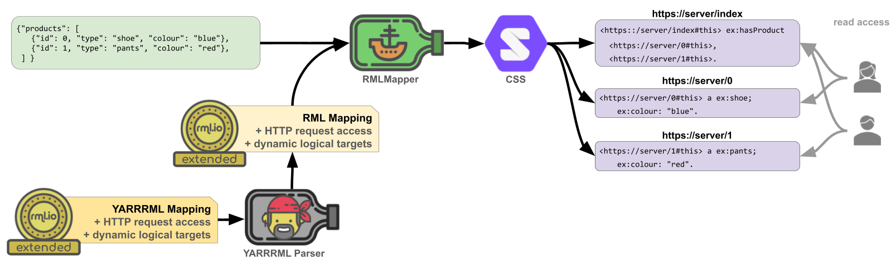

# Demonstrator of the RML+Solid pipeline

## Introduction

This demonstrator showcases the capabilities of the RML+Solid pipeline presented in the paper 'Extending RML to Support Permissioned Data Sharing'. 

The RML+Solid pipeline takes heterogeneous data sources and an extended RML mapping as input. 
Following RML extensions are included in the extended RML mapping:  
- [HTTP Request Access specification](https://rml.io/specs/access/httprequest/20241212/)
- [Dynamic Target specification](https://rml.io/specs/target/dynamictarget/20241212/)

The extended RML mapping is executed with [RMLMapper v7.2.0](https://github.com/RMLio/rmlmapper-java/releases/tag/v7.2.0) as RML processor.  
The extended RML mapping defines logical targets for resources on a Solid pod hosted by a [Community Solid Server v7.1.3](https://github.com/CommunitySolidServer/CommunitySolidServer/releases/tag/v7.1.3).  




## Conceptual Setup

The demonstrator simulates how three manufacturers share their data with ten users, each with distinct access rights to the manufacturers' data.   
Per manufacturer, we created  
(i) source data about products and their properties: 
[./manufacturer1/data/](./manufacturer1/data/),
[./manufacturer2/data/](./manufacturer2/data/), and
[./manufacturer3/data/](./manufacturer3/data/);     
(ii) a CSV file to manage the access control: 
[./manufacturer1/data/read_access.csv](./manufacturer1/data/read_access.csv),
[./manufacturer2/data/read_access.csv](./manufacturer2/data/read_access.csv), and
[./manufacturer3/data/read_access.csv](./manufacturer3/data/read_access.csv);   
(iii) an extended RML mapping: 
[./manufacturer1/mapping.rml.ttl](./manufacturer1/mapping.rml.ttl),
[./manufacturer2/mapping.rml.ttl](./manufacturer2/mapping.rml.ttl) and
[./manufacturer3/mapping.rml.ttl](./manufacturer3/mapping.rml.ttl);  
and (iv) and a Solid pod hosted on a Solid Community Server: [./CommunitySolidServer/pods/manufacturer1/](./CommunitySolidServer/pods/manufacturer1/),
[./CommunitySolidServer/pods/manufacturer2/](./CommunitySolidServer/pods/manufacturer2/), and
[./CommunitySolidServer/pods/manufacturer3/](./CommunitySolidServer/pods/manufacturer3/),

For the users, who get read access to selected parts of the manufacturers' data, we created ten additional Solid pods:
[./CommunitySolidServer/pods/userX/](./CommunitySolidServer/pods/)
.

The authentication details for the manufacturers and users adhere to following pattern (X should be replaced the manufacturer's or user's number): 

| email                   | password | webId                                                   | oidcIssuer                        |  
|-------------------------|----------|---------------------------------------------------------|-----------------------------------|
| hello@manufacturerX.com | abc123   | http://localhost:3000/manufacturerX/profile/card#me     | http://localhost:3000/            |  
| hello@userX.com         | abc123   | http://localhost:3000/userX/profile/card#me | http://localhost:3000/            |  

With the RML+Solid pipeline, we execute the extended RML mappings to convert the source data and access control data to RDF data and to publish the RDF data on the Solid pods of the manufacturers.

## Technical Setup

### Prerequisites

- a bash shell 
- Java version 17 (We tested with OpenJDK v17.0.2)
- [Docker Engine](https://docs.docker.com/engine/)
- Node (We tested with Node v20.00.0)

### Community Solid Server
To avoid any library conflicts, especially with Comunica, we start the Communtiy Solid server as a Docker. 
To start the Community Solid Server, run following command: 
```shell
cd ./CommunitySolidServer
docker run --rm -v $(pwd)/config:/config -v $(pwd)/pods:/pods -p 3000:3000 solidproject/community-server -c /config/file.json --seedConfig /config/seeded-pod-config.json -f /pods --name CSS
```
**Note for Windows users**: Using `$(pwd)` won't just work to get the "present working dir". Here are a few alternatives:
- MinGW / git bash: use `/$(pwd)`
- Windows command line (cmd): `%cd%`
- PowerShell: `${PDW}`  
Example for PowerShell: 
````
docker run --name CSS --rm -v ${PWD}/config:/config -v ${PWD}/pods:/pods -p 3000:3000 solidproject/community-server -c /config/file.json --seedConfig /config/seeded-pod-config.json -f /pods
````

The configuration of the Solid pods can be adapted in this file: 
[./CommunitySolidServer/config/seeded-pod-config.json](./CommunitySolidServer/config/seeded-pod-config.json). 

In this repository contains the state of the Solid pods after executing the RML mappings. 
This allows us to refer to specific resources on the Solid pods to explain the features of the RML+Solid pipeline.   
To restart from scratch, stop the docker, delete the content of the folder [./CommunitySolidServer/pods](./CommunitySolidServer/pods), restart the CommunitySolidServer,and execute the RML mappings with RMLMapper.

In a new terminal:  
```shell
docker stop CSS
cd ./CommunitySolidServer
rm -r ./pods/
docker run --name CSS --rm -v $(pwd)/config:/config -v $(pwd)/pods:/pods -p 3000:3000 solidproject/community-server -c /config/file.json --seedConfig /config/seeded-pod-config.json -f /pods
```

### RMLMapper

- Download [RMLMapper v7.2.0](https://github.com/RMLio/rmlmapper-java/releases/download/v7.2.0/rmlmapper-7.2.0-r374-all.jar) as `rmlmapper.jar` in this folder  
- In a new terminal execute the extended RML mapping of the three manufacturers (this may take some minutes).
````shell
cd ./manufacturer1
echo 'Executing mapping manufacturer1...'
java -jar ../rmlmapper.jar -m mapping.rml.ttl -d
cd ../manufacturer2
echo 'Executing mapping manufacturer2...'
java -jar ../rmlmapper.jar -m mapping.rml.ttl -d
cd ../manufacturer3
echo 'Executing mapping manufacturer3...'
java -jar ../rmlmapper.jar -m mapping.rml.ttl -d
````
The content of the Solid pods after the executing of the RML+Solid pipeline can be inspected easily in the backend of the Community Solid Server: [./CommunitySolidServer/pods/manufacturer1](./CommunitySolidServer/pods/manufacturer1),
[./CommunitySolidServer/pods/manufacturer2](./CommunitySolidServer/pods/manufacturer2), and
[./CommunitySolidServer/pods/manufacturer3](./CommunitySolidServer/pods/manufacturer3). 


### CSS-Getter

The content of Solid resources can be accessed with standardized HTTP GET requests.
However, to access permissioned resources (i.e. resources without public access), authentication is needed before execution the HTTP request.   
For this demonstrator, we provide a JavaScript application, [.CSS-Getter](./CSS-Getter), facilitating the execution of authenticated HTTP GET requests to a Community Solid Server.   

To install the dependencies for this application run:
````shell
cd ./CSS-Getter
npm i
````

## MAPPING TO FUNCTIONAL REQUIREMENTS

### 1. Semantic interoperability [R1]

RML secures the semantic interoperability,
mapping the source data to any RDF ontology to secure a common understanding of the data.

#### 1.1. Different sources mapped to the same ontology
Manufacturer1 maps source files [./manufacturer1/products.csv](manufacturer1/data/products.csv) and [./manufacturer1/products2.json](manufacturer1/data/products2.json) to resource [http://localhost:3000/manufacturer1/products](CommunitySolidServer/pods/manufacturer1/products$.ttl).  
Manufacturer2 maps source file [./manufacturer2/articles.xml](manufacturer2/data/articles.xml) to resource [http://localhost:3000/manufacturer2/articles](CommunitySolidServer/pods/manufacturer2/articles$.ttl).  
Manufacturer3 maps source files [./manufacturer3/products.csv](manufacturer3/data/products.csv) and [./manufacturer3/products2.json](manufacturer3/data/products2.json) to resource[http://localhost:3000/manufacturer3/products](CommunitySolidServer/pods/manufacturer3/products$.ttl).
Three manufacturers map their source data to the same ontology, i.e. they used the same RDF terms to express the concepts and properties.  

#### 1.2. Same sources mapped to two ontologies

Manufacturer1 and Manufacturer3 maps their source data additionally to another ontology:
[products-other-ontology](CommunitySolidServer/pods/manufacturer1/products-other-ontology$.ttl) and
[products-other-ontology](CommunitySolidServer/pods/manufacturer1/products-other-ontology$.ttl).

### 2. Technical interoperability: Read access [R3] 

A Solid resource can be accessed with a HTTP requests. 
Below example shows how a resource with public read access can be accessed. 
````shell
curl -H "Accept: application/n-triples" "http://localhost:3000/manufacturer2/articles"
````
When the access to a resources is restricted to selected users, an authenticated HTTP GET request is needed.   

Each manufacturer has access read access to all his resources. 
````shell
node ./CSS-Getter/getResource.js email=hello@manufacturer1.com password=abc123 webId=http://localhost:3000/manufacturer1/profile/card#me oidcIssuer=http://localhost:3000/ absoluteURI=http://localhost:3000/manufacturer1/products  
````
````shell
node ./CSS-Getter/getResource.js email=hello@manufacturer1.com password=abc123 webId=http://localhost:3000/manufacturer1/profile/card#me oidcIssuer=http://localhost:3000/ absoluteURI=http://localhost:3000/manufacturer1/products-a  
````

Other users have access to selected resources, e.g. user1 has read access to http://localhost:3000/manufacturer1/product-10001
````shell
node ./CSS-Getter/getResource.js email=hello@user1.com password=abc123 webId=http://localhost:3000/user1/profile/card#me oidcIssuer=http://localhost:3000/ absoluteURI=http://localhost:3000/manufacturer1/product-10001 
````

````shell
node ./CSS-Getter/getResource.js email=hello@user4.com password=abc123 webId=http://localhost:3000/user4/profile/card#me oidcIssuer=http://localhost:3000/ absoluteURI=http://localhost:3000/manufacturer1/product-10001-1 
````

### 3. Access Control [R3]

The manufacturers keep an overview of the access rights to the resources on their Solid pods in a locally stored CSV file, e.g. [./manufacturer1/data/read_access.csv](manufacturer1/data/read_access.csv)
RML maps these data of CSV files to [Access Control List (ACL) rules](https://solidproject.org/TR/wac).
[Linked HTTP requests](https://rml.io/specs/access/httprequest/#LinkedHttpRequest) allow RML to published these ACL rules as an ACL resource on the manufacturer's Solid pod, linked to the resource to which they apply, e.g. [http://localhost:3000/manufacturer1//product-10002.acl](CommunitySolidServer/pods/manufacturer1/product-10002.acl)

The manufacturers manage the read access to the resources on their Solid pods via a locally stored csv file ([./manufacturer1/read_access.csv](manufacturer1/data/read_access.csv) and [./manufacturer2/read_access.csv](manufacturer2/data/read_access.csv)). This data is mapped to ACL files, and linked to the relevant resources in their Solid pods.

Only users with *read access rights* can retrieve the content of a resource.   
**User1** has *read access* to `http://localhost:3000/manufacturer1/product-10002`
````shell
node ./CSS-Getter/getResource.js email=hello@user1.com password=abc123 webId=http://localhost:3000/user1/profile/card#me oidcIssuer=http://localhost:3000/ absoluteURI=http://localhost:3000/manufacturer1/product-10002 
````
**User2** has *no access* to `http://localhost:3000/manufacturer1/product-10002`
````shell
node ./CSS-Getter/getResource.js email=hello@user2.com password=abc123 webId=http://localhost:3000/user2/profile/card#me oidcIssuer=http://localhost:3000/ absoluteURI=http://localhost:3000/manufacturer1/product-10002 
````

### 4. Flexible design [R4]

#### 4.1. Any granularity

The data can be exposed in any granularity. We included following five examples in our setup:
1. one resource including all properties of all products, e.g. [http://localhost:3000/manufacturer1/products](CommunitySolidServer/pods/manufacturer1/products$.ttl)
2. two resources, dividing the information of all products based on two categories of product properties, e.g. [http://localhost:3000/manufacturer1/products-a](CommunitySolidServer/pods/manufacturer1/products-a$.ttl)
3. one resource per product, including all properties of that product, e.g. [http://localhost:3000/manufacturer1/product-10001](CommunitySolidServer/pods/manufacturer1/product-10001$.ttl)
4. two resources per product, dividing the product information  based on two categories of product properties, e.g. [http://localhost:3000/manufacturer1/product-10001-a](CommunitySolidServer/pods/manufacturer1/product-10001-a$.ttl)
5. one resource per property per product  [http://localhost:3000/manufacturer1/product-10001-1](CommunitySolidServer/pods/manufacturer1/product-10001-1$.ttl)

#### 4.2. Overlapping views
Our demo includes examples of overlapping views:
- [http://localhost:3000/manufacturer1/products](CommunitySolidServer/pods/manufacturer1/products$.ttl);
- [http://localhost:3000/manufacturer1/product-10001](CommunitySolidServer/pods/manufacturer1/product-10001$.ttl);
- [http://localhost:3000/manufacturer1/product-10001-1](CommunitySolidServer/pods/manufacturer1/product-10001-1$.ttl).

#### 4.3. Disjoint views
Our demo includes examples of disjoint views:
- [http://localhost:3000/manufacturer1/products-a](CommunitySolidServer/pods/manufacturer1/products-a$.ttl) versus [http://localhost:3000/manufacturer1/products-b](CommunitySolidServer/pods/manufacturer1/products-b$.ttl);
- [http://localhost:3000/manufacturer1/product-10001](CommunitySolidServer/pods/manufacturer1/product-10001$.ttl) versus [http://localhost:3000/manufacturer1/product-10002](CommunitySolidServer/pods/manufacturer1/product-10002$.ttl);
- [http://localhost:3000/manufacturer1/product-10001-1](CommunitySolidServer/pods/manufacturer1/product-10001-1$.ttl) versus [http://localhost:3000/manufacturer1/product-10001-2](CommunitySolidServer/pods/manufacturer1/product-10001-2$.ttl).

### 5. Heterogeneous data sources [R5] 

RML handles heterogeneous source data, with logical sources to describe the access to the sources, and expressions to extract the values from the sources.

The source data of manufacturer1 and of manufacturer 3 is spread over two files, with heterogeneous file formats ([./manufacturer1/products.csv](manufacturer1/data/products.csv) and [./manufacturer1/products2.json](manufacturer1/data/products2.json), [./manufacturer3/products.csv](manufacturer3/data/products.csv) and [./manufacturer3/products2.json](manufacturer3/data/products2.json)) with heterogeneous labels (e.g. ProductID and product_id).

Manufacturer2 has one source file ([./manufacturer2/articles.xml](manufacturer2/data/articles.xml)) with his own labels (e.g. articlenumber).

### 6. Automated Generation [R6]

Once the RML mapping is created, the RML+Solid pipeline generates the RDF data and the corresponding resources on the manufacturer's Solid pod with one command: `java -jar [path-to-rmlmapper.jar] -m [path-to-rmlmapping] -d`. 
Updates in the source data are handled with a new pipeline run.

### 7. Reusable Design [R7]

In our demonstrator the [third manufacturer](./manufacturer3) has organized his source data in a similar way as the [first manufacturer](./manufacturer1).
He reuses the RML mapping of the first manufacturer, updating it only with the base URI of his Solid pod, i.e. and with his authentication info. 


## Comparison with the state of the art

|                                                | **Morph-LDP**      | **LDP-DL**         | **RML+SOLID** |
|------------------------------------------------|--------------------|--------------------|---------------|
| **R1 Semantic interoperability**               | &check; | &check;            | &check;       |
| **R2 Technical interoperability: read access** |  &check;                  | &check;            | &check;       |
| **R3 Access control**                          |                    |                    | &check;       |
| **R4 Flexible design**                         |                    | &check;            | &check;       |
| **R5 Heterogeneous data sources**              |                    | &check;            |  &check;             |
| **R6 Automated generation**                    | &check;                   |  &check;                  |&check;               |
| R7 Reusable design                             |  &check;                  | &check;                   |&check;               |
| R8 On-the-fly-generation                       | &check;                   | &check;                   |               |
| R9 Technical interoperability: write access    |       &check;             |                    |               |


